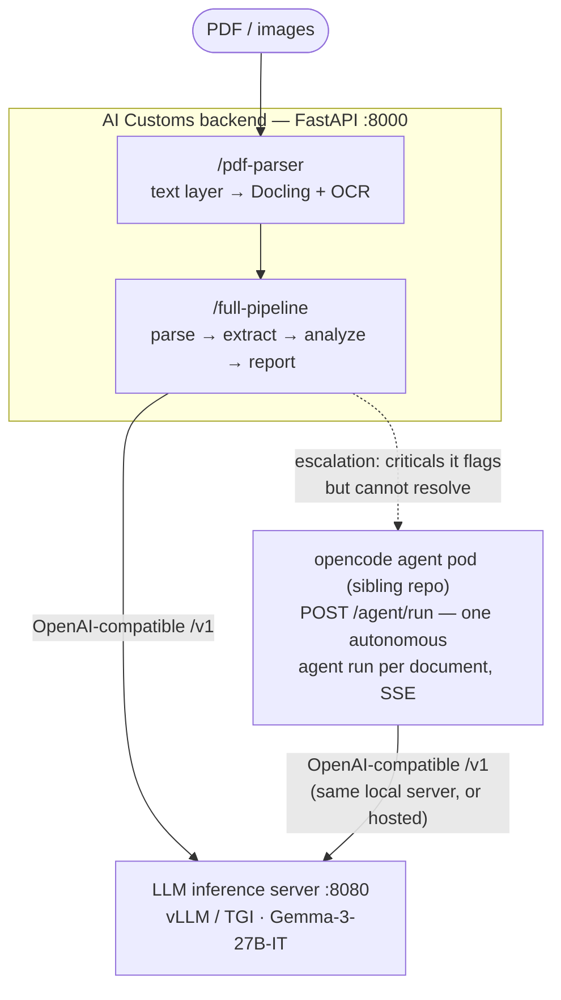

<div align="center">

# 🛃 AI Customs

**Self-hosted LLM for detecting discrepancies in customs declarations**

*Trade documents in → structured analysis + risk report out — entirely on local GPUs, no data leaving the environment.*


</div>

---

It ingests trade documents (commercial invoices, customs declarations, packing
lists, certificates of origin, …), extracts structured fields, and cross-checks
them for valuation, classification, origin, and compliance issues — all running
**entirely on local hardware**.

## Why self-hosted?

Customs and trade data is highly sensitive and often subject to legal
restrictions on where it may be processed. Rather than sending documents to a
hosted API, this system runs an open-weight model (Google **Gemma-3-27B-IT**)
on local GPUs behind an OpenAI-compatible inference server, so declarations
never leave the operator's infrastructure.

## Architecture



Two independently deployable pieces in this repo:

1. **`backend/`** — a FastAPI application that orchestrates document parsing and
   LLM analysis. It talks to the model over an OpenAI-compatible `/v1` endpoint.
   **vLLM is the primary serving engine**; TGI also works (both are
   OpenAI-compatible), and `backend/run_stack.bash` can bring up either.
2. **`llm_service_manual/`** — a self-contained, field-tested Docker deployment
   for serving Gemma-3 with **Text Generation Inference (TGI)** — the alternative
   engine, kept for comparison. Includes a model downloader, GPU auto-detection
   entrypoint, and troubleshooting guide.

The dashed tier is the **opencode agent flow** — a sibling service
(`../opencode-agent-pod`) that handles the documents the scripted pipeline flags
but cannot resolve. See [Calling the opencode agent flow](#calling-the-opencode-agent-flow)
and the head-to-head comparison in [`eval/README.md`](eval/README.md).

## Pipeline

| Stage | Component | What it does |
|-------|-----------|--------------|
| 1. Parse | `pdf_parser` (text layer → Docling) | Extract clean text + tables. Born-digital PDFs are read from their embedded text layer in ~0.1s; scans fall back to Docling + OCR. |
| 2. Extract & Analyze | `declaration_analyzer` (LLM) | Language-agnostic field extraction and discrepancy detection via structured (JSON-schema) output. |
| 3. Report | `full_pipeline` | Chains parsing → analysis → a comprehensive final report in one call. |

The design principle is **"clean content extraction vs. intelligent
extraction"**: the parser is responsible only for turning documents into clean
text, and the LLM is responsible for all field interpretation and reasoning.
This keeps the system language- and layout-agnostic.

### PDF parsing: why two tiers

Docling is an excellent *document-understanding* stack (neural layout model,
table transformer, OCR) — and measurably the wrong *default*. Benchmarked on a
real customs dataset (30 Cameroonian trade documents: vehicle identification
fiches, e-FORCE tracking sheets, SGS valuation reports), running every document
through Docling unconditionally cost ~14 CPU-minutes per document and, on some
born-digital forms, produced *worse* text than the PDF already contained
(letter-spaced shredding such as `C O N TR O LE`, mangled names, mojibake in
accented characters) — while the same file's embedded text layer was perfect
and readable in ~0.1 seconds.

So the parser routes cheap-first:

1. **Text layer (PyMuPDF)** — used when every page carries enough *visibly
   rendered* text. Counting only visible characters matters: scanner apps
   (e.g. CamScanner) embed an invisible, low-quality OCR overlay that looks
   like a text layer but corrupts dates and reference numbers. Those pages are
   rejected here so our own, better OCR reads the image instead.
2. **Docling + Tesseract/EasyOCR** — everything else: pure scans, OCR-overlay
   PDFs, and mixed documents (any page below the visible-text threshold sends
   the whole document down this path).

On the benchmark dataset this routes 17/30 documents through the fast path
(seconds → sub-second, with strictly better text than Docling produced for
them) and reserves the neural stack for the 13 scans that genuinely need it —
where it earns its cost: Docling+OCR fully recovered an image-only valuation
report (product, weights, container, values, HS code). Set
`PDF_PREFER_TEXT_LAYER=false` (or the `high_accuracy` environment) to force
the full neural parse for every document.

## Hardware

Developed and tested on a workstation with:

- **2× NVIDIA RTX A6000 (48 GB VRAM each, 96 GB total)**
- Gemma-3-27B-IT served with tensor parallelism across both GPUs
  (`--tensor-parallel-size 2` for vLLM / `--num-shard 2` for TGI)

96 GB of aggregate VRAM comfortably fits the 27B model in `float16` with room
for KV cache. Smaller GPUs can run smaller models by changing the model ID and
sharding settings (see `llm_service_manual/env.template`).

## Tech stack

- **API:** FastAPI + Uvicorn
- **Document parsing:** [Docling](https://github.com/DS4SD/docling), Tesseract / EasyOCR, PyMuPDF
- **LLM serving:** [vLLM](https://github.com/vllm-project/vllm) (primary) or [TGI](https://github.com/huggingface/text-generation-inference) — both OpenAI-compatible
- **Model:** Google Gemma-3-27B-IT (open weights)
- **Structured output:** Pydantic v2 + JSON-schema-constrained generation
- **Prompts:** Jinja2 templates (`backend/core/llm/prompts/*.j2`)

---

## Quick start

The system has two halves — the **LLM inference server** and the **backend**.
Start the model server first, then point the backend at it.

### 1. Serve the model

Fastest path — run **vLLM** directly (the primary engine, matches the 2-GPU
setup above):

```bash
docker run --gpus all \
  -v ~/models/gemma-3-27b-it:/models/gemma-3-27b-it \
  -p 8080:80 --shm-size 2g \
  vllm/vllm-openai:latest \
  --model /models/gemma-3-27b-it --served-model-name gemma-3-27b-it \
  --dtype auto --port 80 --tensor-parallel-size 2
```

Prefer TGI instead? A more robust, configurable TGI deployment (model
downloader, GPU auto-detection, health checks) lives in `llm_service_manual/`:

```bash
cd llm_service_manual
cp env.template .env      # customize model, GPUs, batch sizes
./install.sh              # downloads model, builds & starts TGI
```

See [`llm_service_manual/README.md`](llm_service_manual/README.md) and
[`llm_service_manual/TROUBLESHOOTING.md`](llm_service_manual/TROUBLESHOOTING.md)
for details.

### 2. Run the backend

The one-command script builds the backend image, starts the model server, wires
them together on a Docker network, waits for both to be healthy, and prints a
smoke-test command:

```bash
cd backend
./run_stack.bash          # vLLM by default; or: ./run_stack.bash tgi
```

Ports, GPU count, model path, and timeouts are all overridable via environment
variables — see the header of `run_stack.bash`.

Or run the two pieces manually — see [`backend/README.md`](backend/README.md).

To run the backend without Docker:

```bash
cd backend
python -m venv .venv && source .venv/bin/activate
pip install -r requirements.txt
cp .env.example .env      # set LLM_BASE_URL to your model server
python main.py
```

### 3. Call the API

```bash
# Health check
curl http://localhost:8000/api/v1/health-check

# Run a document through the full pipeline
curl -X POST http://localhost:8000/api/v1/full-pipeline/process \
  -H "Content-Type: application/json" \
  -d @backend/request_body_examples/full_pipeline.json
```

Interactive API docs are available at `http://localhost:8000/docs`.

## API endpoints

All endpoints are under the `/api/v1` prefix.

| Method | Path | Description |
|--------|------|-------------|
| `GET`  | `/health-check` | Liveness check |
| `POST` | `/pdf-parser/parse-direct` | Parse a PDF and return clean content immediately |
| `GET`  | `/pdf-parser/capabilities` | Parser feature/config introspection |
| `POST` | `/full-pipeline/process` | End-to-end (synchronous): parse → extract → analyze → report |

Example request bodies live in [`backend/request_body_examples/`](backend/request_body_examples/).

## Calling the opencode agent flow

The pipeline above is scripted: fixed stages, fixed LLM calls. Its counterpart
is one **autonomous agent run per document** — same model, same output schema,
but the agent reads the document and verifies the arithmetic itself with tools
(`Read`, `Bash`). It is served by the sibling
[`opencode-agent-pod`](../opencode-agent-pod) repo and has no UI; a run is a
single HTTP call.

Bring the pod up (its `.env` supplies `AGENT_POD_TOKEN` and the provider key;
`AGENT_POD_PORT` moves it off 8080 if your model server holds that port):

```bash
cd ../opencode-agent-pod
.venv/bin/python -m pod
```

Then stream a run — the workspace is a read-only pointer to a directory holding
the document, which the pod copies, runs against, and reaps:

```bash
curl -N http://127.0.0.1:8080/agent/run \
  -H "Authorization: Bearer $AGENT_POD_TOKEN" \
  -H "Content-Type: application/json" \
  -d '{
    "model": "gpt-5.4-nano-2026-03-17",
    "prompt": "Read document.txt. List every monetary value, verify the arithmetic by running a python script, and conclude whether the valuation reconciles.",
    "tools": ["Read", "Bash"],
    "max_budget_usd": 0.25,
    "workspace": {"source": "file:///absolute/path/to/doc-dir"}
  }'
```

The response is a Server-Sent Events stream: `token` and `tool` events while
the agent works, then `cost` and a terminal `done` with the result. Add a
`response_schema` (any JSON Schema) to get validated `structured_output` in the
`done` event — the eval passes the pipeline's own `DiscrepancyAnalysisResponse`
schema so both tiers emit the same shape.

The batch runner behind the eval is `dataset/run_agent_pod.py` (the `dataset/`
directory is git-ignored for privacy); results and the pipeline-vs-agent
comparison are in [`eval/README.md`](eval/README.md).

## Configuration

All runtime configuration is environment-driven and centralized under
[`backend/config/`](backend/config/). Copy [`backend/.env.example`](backend/.env.example)
to `backend/.env` and adjust. The most important variable is:

- **`LLM_BASE_URL`** — the OpenAI-compatible endpoint of your model server
  (e.g. `http://host.docker.internal:8080/v1/` when the backend runs in Docker
  alongside a host-served model).

See `backend/.env.example` for the full list (LLM parameters, PDF/OCR settings,
pipeline thresholds, timeouts).

## Project structure

```
ai-customs/
├── backend/                    # FastAPI application
│   ├── api/routers/            # Endpoints: health, pdf_parser, declaration_analyzer, full_pipeline
│   ├── core/
│   │   ├── llm/                # LLM client, request handler, prompts, response models
│   │   ├── schemas/            # Shared API response schemas
│   │   └── utils/              # Logging, errors, throttling, auth
│   ├── config/                 # Centralized env-driven configuration
│   ├── request_body_examples/  # Sample request payloads
│   └── run_stack.bash          # One-command vLLM/TGI + backend bring-up
├── eval/                       # Pipeline vs. opencode-agent-pod comparison on 30 real documents
├── llm_service_manual/         # Packaged TGI Gemma-3 deployment (alternative engine)
└── llm_test_runs/              # Ad-hoc vLLM/TGI API experiments & comparison notes
```

## Development

Linting, formatting, and type-checking are enforced with pre-commit
([Ruff](https://docs.astral.sh/ruff/) for lint + format, and mypy). Ruff's
Pyflakes rules catch dead imports and unused variables and autofix them.

```bash
pip install pre-commit
pre-commit install
pre-commit run --all-files -v
```

Tooling configuration lives in [`backend/pyproject.toml`](backend/pyproject.toml)
(`[tool.ruff]`, `[tool.mypy]`); hook versions live in
[`.pre-commit-config.yaml`](.pre-commit-config.yaml).

## License

No license file is currently included. Note that the Gemma model weights are
subject to Google's [Gemma Terms of Use](https://ai.google.dev/gemma/terms).
