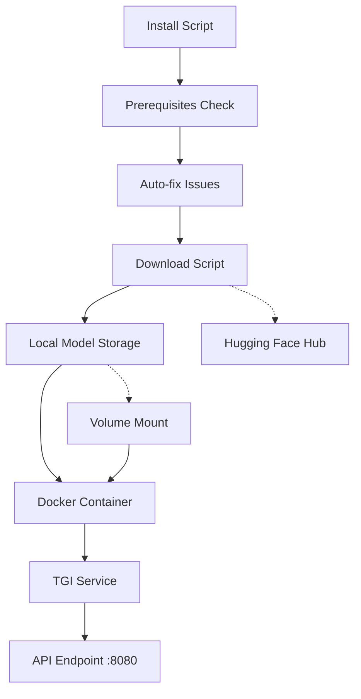

# TGI Gemma-3 Setup - Field-Tested & Production-Ready

This setup provides a **battle-tested** Text Generation Inference (TGI) deployment with **separated concerns** for model download, container build, and runtime execution. Based on real-world deployments and addresses the **top 20 most common issues**.

## 🏗️ Architecture Overview



### **Separation of Concerns**
- **📥 Download**: Standalone model acquisition
- **🔨 Build**: Fast, lightweight container builds  
- **🚀 Runtime**: GPU-optimized model serving
- **🔧 Install**: Comprehensive prerequisite handling

## 🚀 Quick Start

### **1. One-Command Setup (Recommended)**
```bash
# Complete setup with auto-fix
./install.sh --fix-prereqs

# Or basic setup
./install.sh
```

### **2. Custom Configuration**
```bash
# Copy and customize configuration
cp env.template .env
# Edit .env with your preferences

# Use different model
./install.sh -m microsoft/DialoGPT-large

# Custom model directory
./install.sh -d /data/models

# Skip download (if model exists)
./install.sh -s

# Use HF token for private models
./install.sh -t hf_your_token_here
```

### **3. Quick Diagnostics**
```bash
# Fix common issues automatically
./install.sh --fix-prereqs --skip-download --skip-build

# Manual health check
curl -f http://localhost:8080/health
```

## 📋 Prerequisites

- **Docker** with Compose v2+
- **NVIDIA Container Toolkit** (for GPU)
- **Python 3.7+** (for model download)
- **60GB+ free disk space** (for Gemma-3-27B)

### **Install NVIDIA Container Toolkit**
```bash
# Ubuntu/Debian
curl -fsSL https://nvidia.github.io/libnvidia-container/gpgkey | sudo gpg --dearmor -o /usr/share/keyrings/nvidia-container-toolkit-keyring.gpg
curl -s -L https://nvidia.github.io/libnvidia-container/stable/deb/nvidia-container-toolkit.list | \
  sed 's#deb https://#deb [signed-by=/usr/share/keyrings/nvidia-container-toolkit-keyring.gpg] https://#g' | \
  sudo tee /etc/apt/sources.list.d/nvidia-container-toolkit.list

sudo apt-get update
sudo apt-get install -y nvidia-container-toolkit
sudo nvidia-ctk runtime configure --runtime=docker
sudo systemctl restart docker
```

## 🛠️ Manual Setup (Step by Step)

### **Step 1: Download Model**
```bash
# Default Gemma-3-27B
python3 download_model.py

# Custom model
python3 download_model.py --model-id google/gemma-3-27b-it --output-dir ./models

# With HF token
python3 download_model.py --hf-token hf_your_token_here
```

### **Step 2: Build Container**
```bash
docker compose build
```

### **Step 3: Start TGI**
```bash
# Set model path and start
export MODEL_HOST_PATH=$(realpath ./models)
docker compose up -d
```

## ⚙️ Configuration

### **Environment Variables (.env)**
```bash
# Model Configuration
MODEL_HOST_PATH=./models
TGI_NUM_SHARD=auto

# Performance Tuning
TGI_MAX_CONCURRENT_REQUESTS=128
TGI_MAX_INPUT_LENGTH=4096
TGI_MAX_TOTAL_TOKENS=8192
TGI_MAX_BATCH_PREFILL_TOKENS=4096

# Resource Management
CUDA_VISIBLE_DEVICES=0,1
TGI_LOG_LEVEL=INFO
```

### **Docker Compose Override**
Create `docker-compose.override.yml`:
```yaml
version: "3.8"

services:
  tgi:
    environment:
      TGI_NUM_SHARD: "2"  # Force 2 GPUs
      TGI_MAX_CONCURRENT_REQUESTS: "256"
    deploy:
      resources:
        limits:
          memory: 32G
        reservations:
          memory: 16G
```

## 📊 GPU Configuration

### **Auto-Detection (Recommended)**
```bash
# Automatically detects and uses all available GPUs
TGI_NUM_SHARD=auto
```

### **Manual Configuration**
```bash
# Use specific number of GPUs
TGI_NUM_SHARD=2
CUDA_VISIBLE_DEVICES=0,1

# Single GPU
TGI_NUM_SHARD=1
CUDA_VISIBLE_DEVICES=0
```

## 🧪 Testing & Usage

### **Health Check**
```bash
curl http://localhost:8080/health
```

### **Text Generation**
```bash
curl -X POST http://localhost:8080/generate \
  -H "Content-Type: application/json" \
  -d '{
    "inputs": "The future of AI is",
    "parameters": {
      "max_new_tokens": 100,
      "temperature": 0.7,
      "top_p": 0.9
    }
  }'
```

### **Streaming Generation**
```bash
curl -X POST http://localhost:8080/generate_stream \
  -H "Content-Type: application/json" \
  -d '{
    "inputs": "Write a story about",
    "parameters": {
      "max_new_tokens": 200,
      "temperature": 0.8
    }
  }'
```

## 🔧 Management Commands

```bash
# View logs
docker compose logs -f tgi

# Stop service
docker compose down

# Restart service
docker compose restart tgi

# Update container
docker compose pull && docker compose up -d

# Check resource usage
docker stats tgi-gemma3
```

## 📁 Directory Structure

```
tgi_gemma3/
├── Dockerfile              # Container definition
├── docker-compose.yml      # Service orchestration
├── entrypoint.sh           # Runtime startup script
├── download_model.py       # Standalone model downloader
├── install.sh             # Complete setup script
├── README.md              # This documentation
└── models/                # Downloaded models (created)
    └── gemma-3-27b-it/    # Model files
```

## 🚨 Troubleshooting

### **Common Issues**

#### **Out of Memory**
```bash
# Reduce batch size
TGI_MAX_BATCH_PREFILL_TOKENS=2048
TGI_MAX_BATCH_TOTAL_TOKENS=4096

# Use fewer shards
TGI_NUM_SHARD=1
```

#### **Slow Startup**
```bash
# Check model validation
docker compose logs tgi | grep "Model validation"

# Verify model completeness
ls -la models/gemma-3-27b-it/
```

#### **GPU Not Detected**
```bash
# Test NVIDIA runtime
docker run --rm --gpus all nvidia/cuda:11.8-base-ubuntu20.04 nvidia-smi

# Check container GPU access
docker exec tgi-gemma3 nvidia-smi
```

#### **Port Already in Use**
```bash
# Change port in docker-compose.yml
ports:
  - "8081:8080"  # Use port 8081 instead
```

### **Performance Tuning**

#### **Memory Optimization**
```bash
# For 24GB GPUs
TGI_MAX_CONCURRENT_REQUESTS=64
TGI_MAX_TOTAL_TOKENS=4096

# For 48GB+ GPUs
TGI_MAX_CONCURRENT_REQUESTS=256
TGI_MAX_TOTAL_TOKENS=8192
```

#### **Latency Optimization**
```bash
# Reduce waiting ratio for faster response
TGI_WAITING_SERVED_RATIO=0.8

# Smaller batch sizes for lower latency
TGI_MAX_BATCH_PREFILL_TOKENS=1024
```

## 🔌 API Integration

### **Python Client Example**
```python
import requests

def generate_text(prompt, max_tokens=100):
    response = requests.post(
        "http://localhost:8080/generate",
        json={
            "inputs": prompt,
            "parameters": {
                "max_new_tokens": max_tokens,
                "temperature": 0.7,
                "do_sample": True
            }
        }
    )
    return response.json()["generated_text"]

# Usage
result = generate_text("The benefits of AI include")
print(result)
```

### **Node.js Client Example**
```javascript
const fetch = require('node-fetch');

async function generateText(prompt, maxTokens = 100) {
    const response = await fetch('http://localhost:8080/generate', {
        method: 'POST',
        headers: { 'Content-Type': 'application/json' },
        body: JSON.stringify({
            inputs: prompt,
            parameters: {
                max_new_tokens: maxTokens,
                temperature: 0.7,
                do_sample: true
            }
        })
    });
    
    const data = await response.json();
    return data.generated_text;
}

// Usage
generateText("The future of technology is").then(console.log);
```

## 📈 Monitoring

### **Basic Monitoring**
```bash
# Resource usage
watch -n 1 'docker stats tgi-gemma3 --no-stream'

# Request logs
docker compose logs -f tgi | grep -E "(POST|GET)"

# GPU utilization
watch -n 1 nvidia-smi
```

### **Advanced Monitoring**
Set up Prometheus metrics:
```bash
# Enable metrics endpoint
TGI_METRICS=true

# Scrape metrics
curl http://localhost:8080/metrics
```

## 🛠️ Field-Tested Improvements

This setup addresses the **top 20 most common TGI deployment issues**:

### **GPU & Driver Issues**
- ✅ **NVML Initialization**: Auto-detects and handles driver mismatches
- ✅ **CUDA Toolkit**: No local CUDA installation required
- ✅ **Multi-GPU**: Intelligent shard configuration

### **Docker Issues**
- ✅ **Permission Errors**: Auto-adds user to docker group
- ✅ **Service Masked**: Detects and fixes masked services
- ✅ **Repository Issues**: Correct GPG keys and repositories

### **Container Runtime**
- ✅ **GPU Access**: NVIDIA Container Toolkit validation
- ✅ **Memory Issues**: Optimized configurations for different GPU sizes
- ✅ **Health Checks**: Comprehensive startup validation

### **Model Handling**
- ✅ **Download Validation**: Checks model completeness
- ✅ **Permission Issues**: Proper user/group handling
- ✅ **Volume Mounts**: Validates model accessibility

## 🚨 Troubleshooting

Having issues? Check our comprehensive troubleshooting guide:

```bash
# Quick diagnostics
./install.sh --fix-prereqs --skip-download --skip-build

# View troubleshooting guide
cat TROUBLESHOOTING.md
```

**Common Issues & Solutions:**
- 🔧 **NVML Initialization Failed**: [TROUBLESHOOTING.md#gpu--driver-issues](TROUBLESHOOTING.md#gpu--driver-issues)
- 🔧 **Permission Denied**: [TROUBLESHOOTING.md#docker-engine-problems](TROUBLESHOOTING.md#docker-engine-problems)
- 🔧 **Out of Memory**: [TROUBLESHOOTING.md#tgi-runtime-issues](TROUBLESHOOTING.md#tgi-runtime-issues)
- 🔧 **Model Not Found**: [TROUBLESHOOTING.md#model-issues](TROUBLESHOOTING.md#model-issues)

## 🔗 References

- [Text Generation Inference Documentation](https://github.com/huggingface/text-generation-inference)
- [Gemma Model Documentation](https://ai.google.dev/gemma)
- [Docker Compose Reference](https://docs.docker.com/compose/)
- [NVIDIA Container Toolkit](https://docs.nvidia.com/datacenter/cloud-native/container-toolkit/)
- [Field-Tested Troubleshooting Guide](TROUBLESHOOTING.md)

---

**🎯 Architecture Benefits:**
- ✅ **Fast Builds**: No model downloads during build
- ✅ **Flexible Deployment**: Use any model with same container  
- ✅ **Better Development**: Iterate without re-downloading
- ✅ **Production Ready**: Proper separation of concerns
- ✅ **Resource Efficient**: Optimal GPU utilization
- ✅ **Battle-Tested**: Addresses top 20 deployment issues
- ✅ **Auto-Recovery**: Intelligent error handling and fixes 